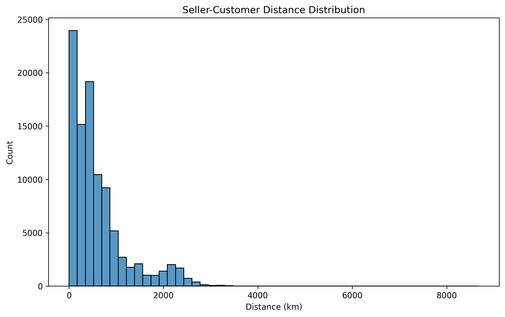
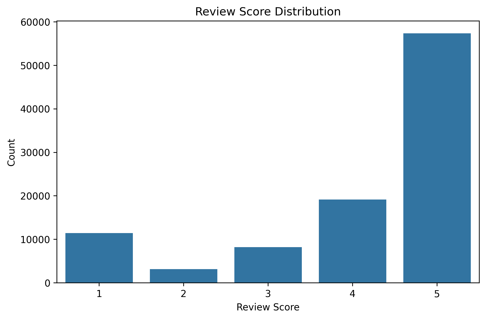
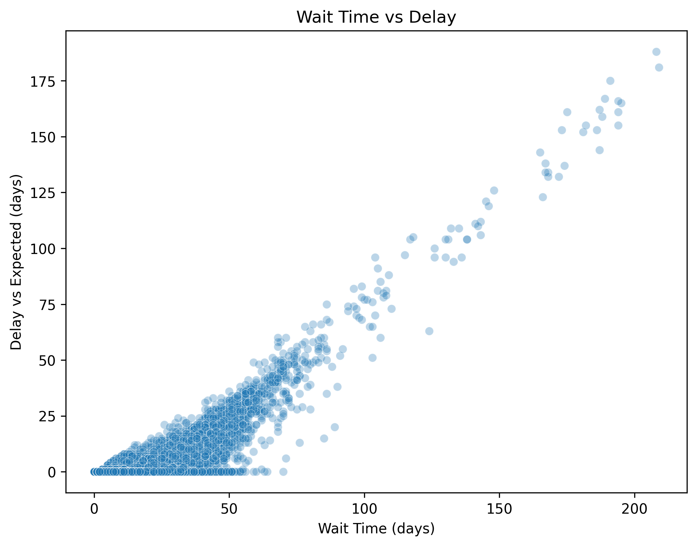

#  Olist Orders Data Analysis & Feature Engineering

This project focuses on transforming raw Olist e-commerce data into a **clean, feature-rich dataset** ready for analytics and machine learning.

The main objective is to aggregate multiple datasets into a **single order-level table** capturing delivery performance, pricing, and customer satisfaction.

---

##  Project Objective

Build a unified dataset including:

*  Delivery performance metrics
*  Customer review behavior
*  Order complexity (items & sellers)
*  Pricing & freight cost
*  Customer–seller distance (optional)

---

##  Dataset Overview

Datasets used:

* `orders`
* `order_items`
* `order_reviews`
* `customers`
* `sellers`
* `products`
* `geolocation`

---

##  Feature Engineering

###  Delivery Performance (`get_wait_time`)

* `wait_time`
* `expected_wait_time`
* `delay_vs_expected`
* `order_status`

✔ Only **delivered orders** are included
✔ Datetime transformations applied

---

###  Review Score (`get_review_score`)

* `review_score`
* `dim_is_five_star`
* `dim_is_one_star`

✔ Binary indicators for extreme satisfaction

---

###  Number of Items (`get_number_items`)

* Total number of products per order

---

###  Number of Sellers (`get_number_sellers`)

* Unique sellers per order

---

###  Price & Freight (`get_price`)

* `price` → total order value
* `freight_value` → total shipping cost

---

###  Distance (`get_distance_seller_customer`)

* Distance between customer and seller (km)
* Calculated using **Haversine formula**
* Averaged per order (if multiple sellers)

---

##  Final Dataset (`get_training_data`)

All features are merged into a single DataFrame:

* Joined on `order_id`
* Missing values removed
* Ready for ML / analytics

---

##  Final Features

| Feature                  | Description        |
| ------------------------ | ------------------ |
| order_id                 | Unique order ID    |
| wait_time                | Delivery duration  |
| expected_wait_time       | Estimated delivery |
| delay_vs_expected        | Delay vs estimate  |
| review_score             | Customer rating    |
| dim_is_five_star         | 5-star flag        |
| dim_is_one_star          | 1-star flag        |
| number_of_items          | Total items        |
| number_of_sellers        | Unique sellers     |
| price                    | Total price        |
| freight_value            | Shipping cost      |
| distance_seller_customer | Distance (km)      |

---

##  Visual Insights

###  Distance Distribution



###  Review Score Distribution



###  Wait Time vs Delay



---

##  Key Insights

*  Majority of orders receive **5-star reviews**
*  Longer delivery times increase **delay risk**
*  Multi-seller orders introduce complexity
*  Distance shows a **long-tail distribution** (up to ~8000+ km)
*  Logistics performance directly impacts customer satisfaction

---

##  Testing

All features are validated with **pytest**:

* ✔ wait_time
* ✔ review_score
* ✔ number_items
* ✔ number_sellers
* ✔ price
* ✔ training_data
* ✔ distance

---

##  Tech Stack

* Python 🐍
* Pandas
* NumPy
* Seaborn & Matplotlib
* Pytest

---

##  How to Run

```bash
git clone <your-repo-link>
cd data-orders

pip install -r requirements.txt

pytest -v
```

---

## Business Value

This dataset enables:

*  Delivery delay analysis
*  Customer satisfaction modeling
*  Price vs review relationship
*  Distance impact on logistics

---

##  Author

Doruk Pamir
Data Analyst

---

##  Next Steps

* Machine Learning model (review prediction)
* Feature importance analysis
* Power BI dashboard
* Advanced EDA & storytelling
